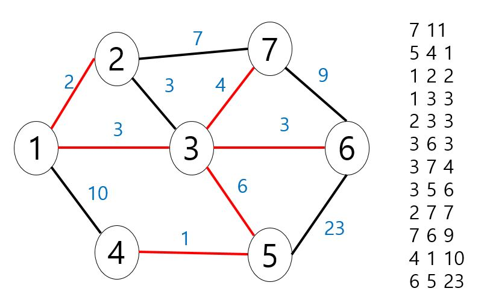

# 크루스칼 알고리즘(Kruskal Algorithm)

- Disjoint-Set 자료 구조 활용

- 프림은 원리상 노드를 중심으로 간선을 탐색

- 크루스칼은 간선을 중심으로 탐색하면서 노드를 확인용으로만 사용

- 모든 간선을 대상으로 가장 비용이 작은 간선을 선택

- 현재 까지 선택된 노드들 끼리 사이클이 생기지 않는지 확인

- 사이클이 생긴다 -> 무시 / 생기지 않는다 -> 선택

<pre>
<code>

    package com.Algoritm.Greedy;

    import java.io.*;
    import java.util.*;

    class A implements Comparable<A>{
        int start,end,weight;
        
        public A(int start,int end,int weight) {
            super();
            this.start=start;
            this.end=end;
            this.weight=weight;
        }

        @Override
        public int compareTo(A o) {
            return o.weight >= this.weight?-1:1;
        }
    }

    public class KruskalTest {
        
        public static int find(int a) {
            //정점이 처음 등장 하면 자기 자신이 부모
            if(a==parent[a]) return a;
            //find 할때 마다 부모는 최상위 부모로 설정
            parent[a] = find(parent[a]);
            return parent[a];
        }
        
        public static void union(int a,int b) {
            int aRoot = find(a);
            int bRoot = find(b);
            
            if(aRoot!=bRoot) {
                parent[aRoot]=b;
            }else {
                return;
            }
        }

        static int N,E,result;
        static PriorityQueue<A> pq;
        static int[] parent;
        static boolean[] visit;
        
        public static void main(String[] args) throws Exception{
            BufferedReader br = new BufferedReader(new InputStreamReader(System.in));
            StringTokenizer st;
            
            st = new StringTokenizer(br.readLine());
            N = Integer.parseInt(st.nextToken()); //정점의 개수
            E = Integer.parseInt(st.nextToken()); //간선의 개수
            
            parent = new int[N+1];	//Disjoint=set
            visit = new boolean[N+1];
            result = 0;
            
            pq = new PriorityQueue<A>();
            for(int i=0;i<E;i++) {
                st = new StringTokenizer(br.readLine());
                int start = Integer.parseInt(st.nextToken());
                int end = Integer.parseInt(st.nextToken());
                int weigth = Integer.parseInt(st.nextToken());
                
                pq.add(new A(start,end,weigth));
            }
            
            for(int i=1;i<=N;i++) {
                parent[i]=i;
            }
            
            for(int i=0;i<E;i++) {
                A oneNode = pq.poll();
                int start = oneNode.start;
                int end = oneNode.end;
                
                //간선 선택시 양쪽의 루트(최상위 노드가 무엇인지 확인)
                int a = find(start);
                int b = find(end);
                
                if(a==b) continue;
                
                union(start,end);
                result += oneNode.weight;
            }
            
            System.out.println(result);
            
        }

    }

    /*
    7 11
    5 4 1
    1 2 2
    1 3 3
    2 3 3
    3 6 3
    3 7 4
    3 5 6
    2 7 7
    7 6 9
    4 1 10
    6 5 23
    */

</code>
<pre>
