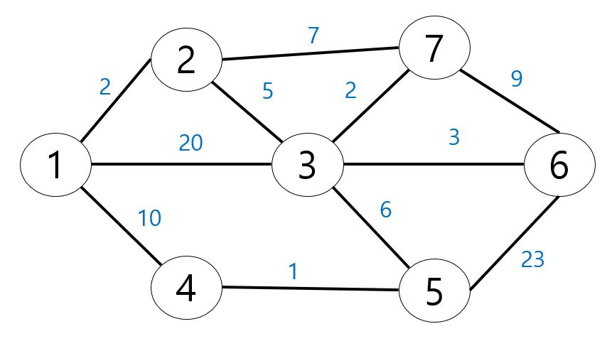
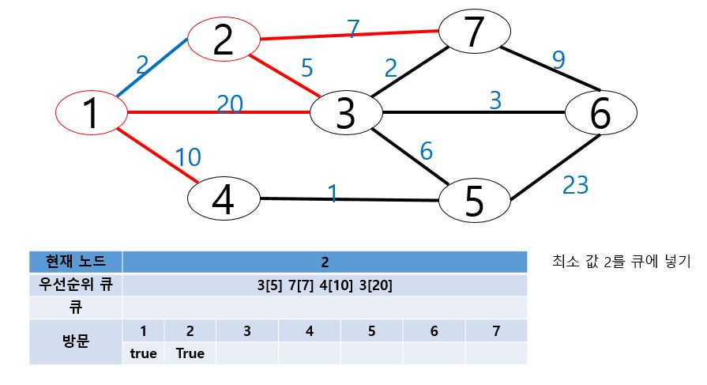
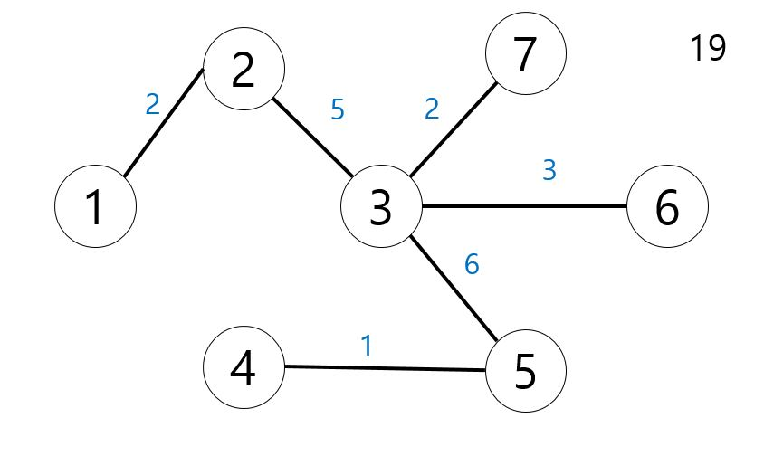

# 프림 알고리즘(Prim Algorithm)

- 노드를 중심으로 탐색해서 최소 신장 트리

- 정점 중 아무 시작 정점을 고른다

- 해당 정점에 연결된 모든 간선 중 가장 최소 비용을 가진 간선을 선택해서 연결한다

- 처음 고른 정점과 선택된 간선에 연결된 정점까지 모든 연결된 정점에 연결된 간선 중 가장 비용이 작은 간선을 선택해 연결한다

- 모든 정점이 연결될 때 까지 2 3 번을 반복한다

- 반복 과정

<pre>
<code>
    package com.Algoritm.Greedy;

    import java.io.*;
    import java.util.*;

    class Node{
        int start,end,weight;
        
        public Node(int start,int end,int weight) {
            super();
            this.start=start;
            this.end=end;
            this.weight=weight;
        }
    }

    public class PrimTest {
        
        static int N,E;
        static ArrayList<Node>[] nodes;
        static boolean visit[];
        static int ans;
        static ArrayList<Node> array = new ArrayList<Node>();

        public static void main(String[] args) throws Exception{
            BufferedReader br = new BufferedReader(new InputStreamReader(System.in));
            StringTokenizer st;
            //최종 최소 비용 출력을 위한 변수
            ans = 0; 
            st = new StringTokenizer(br.readLine());
            N = Integer.parseInt(st.nextToken()); //정점의 개수
            E = Integer.parseInt(st.nextToken()); //간선의 개수
            visit = new boolean[N+1]; //방문 체크용 
            
            //각 노드의 연결 상태를 저장하는 ArrayList
            nodes = new ArrayList[N+1];
            
            for(int i=1;i<=N;i++) {
                nodes[i] = new ArrayList<Node>();
            }
            
            for(int i=0;i<E;i++) {
                st = new StringTokenizer(br.readLine());
                int start = Integer.parseInt(st.nextToken());
                int end = Integer.parseInt(st.nextToken());
                int weight = Integer.parseInt(st.nextToken());
                
                nodes[start].add(new Node(start,end,weight));
                
                nodes[end].add(new Node(end,start,weight));
                
            }
            
            Prim();
            System.out.println();
            
            br.close();
        }

        private static void Prim() {
            //우선 순위큐를 활용해서
            Comp cp = new Comp();
            //비용이 가장 작은 간선을 바로 뽑기 위한 우선순위 큐
            PriorityQueue<Node> pq = new PriorityQueue<Node>(cp);
            Deque<Integer> dq = new ArrayDeque<Integer>();
            dq.add(1); //시작점 1
            ArrayList<Node> tempList;
            Node tempNode;
            while(!dq.isEmpty()) {
                //큐에서 하나 빼서 주변의 노드 넣기
                int currentNode = dq.poll();
                visit[currentNode] = true;
                tempList = nodes[currentNode];
                for(int i=0;i<tempList.size();i++) {
                    if(!visit[tempList.get(i).end]) {
                        //현재 노드에 연결된 모든 간선을 우선순위큐에 add
                        pq.add(tempList.get(i));
                    }
                }
            
                while(!pq.isEmpty()) {
                    tempNode = pq.poll();
                    if(!visit[tempNode.end]) {
                        visit[tempNode.end]=true;
                        ans+= tempNode.weight;
                        dq.add(tempNode.end);
                        break;
                    }
                
                }
            }
            System.out.println(ans);
            }

    }

    class Comp implements Comparator<Node>{

        @Override
        public int compare(Node o1, Node o2) {
            return o1.weight>o2.weight?1:-1;
        }
        
    }
    /*
    7 11
    1 2 2
    1 3 20
    1 4 10
    2 3 5
    2 7 7
    3 5 6
    3 6 3
    3 7 2
    4 5 1
    5 6 23
    6 7 9
    */
</code>
<pre>