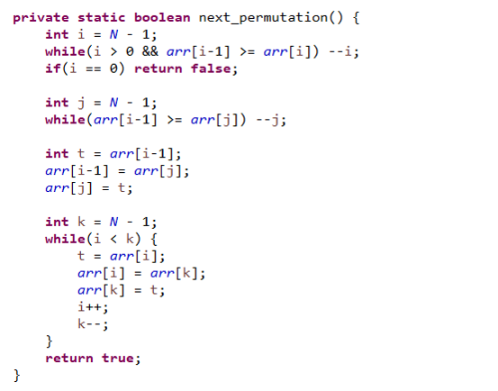

# 다음 순열 Next Permutation

- 모든 순열을 찾기 위해서는 우선 첫 순열과 마지막 순열을 찾고 첫 순열에서 마지막 순열이 나올때 까지 다음 순열, 다음 순열, 다음 순열, ... 마지막 순열까지 반복하면 모든 순열을 만들 수 있음

- 방법
    - 꼭대기를 찾는다
        - 리스트의 가장 큰 값인 꼭대기를 찾는다.
     꼭대기가 0번째 인덱스가 되는 순간이 순열의 마지막 순서

    - 다음 순열의 값 찾기
        - 마지막 인덱스에서부터 꼭대기-1 번째 인덱스의 값보다 큰 값을 가진
    인덱스( j )를 찾는다. 
     인덱스 j를 찾았다면 list[i-1]과 list[j]를 swap.

     - 순서 정해주기
        - 다음 순열을 정해주기 위해서 현재 i번째부터 마지막 인덱스까지
      순서대로 swap.

