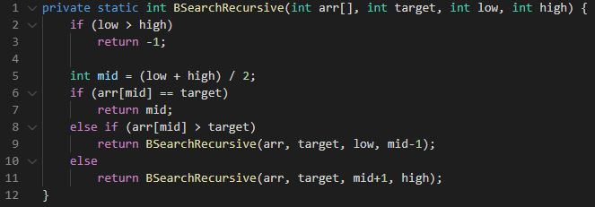

# 분할정복 - 이진검색(Divide And Conquer Algorithm - Binary Search)

## 분할 정복

- 분할 : 문제를 여러 개의 소문제로 나눔

- 정복 : 나눠진 문제를 각각 해결

- 통합 : 해결된 해답을 모음

## 이진 검색

- 목적 키를 찾을 때까지 이진 검색을 순환적으로 반복

- 검색 범위를 반으로 줄이면서 검색 수행

- 조건 : 자료가 정렬된 상태여야 함

- 방법
    - 중앙 원소 선택
    - 중앙 원소와 목표 값 비교
    - 일치하면 탐색 종료
    - 중앙에서 목표 쪽으로 탐색 시작

- 구현

