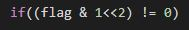
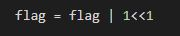
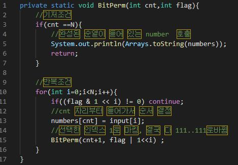

# 비트 마스킹 순열(BitMasking Permutation)

- N 개 중에서 N 개를 뽑는 순열은 결국, 모든 원소를 선택하지만 순서가 중요 -> 순서의 변화

- 비트를 움직여 1로 마킹하여 순서를 변화 시킴

- 인덱스의 원소의 선택 여부를 int flag로 확인

- flag가 1일 때 1 << 2 는 비트로 100 이 되고 & 연산을 통해 비트가 0이 아니면 선택된 것이다.

- 해당 인덱스의 원소를 선택하고, flag에 표시

- 최종

