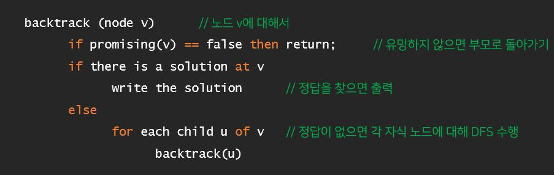

# BackTracking

## 해를 찾는 도중 해가 아니라면, 되돌아가서 다시 해를 찾는 기법
## 주로 재귀 함수로 구현

- DFS 와의 차이점
    - DFS는 가능한 모든 후보를 탐색
    - 불필요한 후보를 사전에 차단하지 않으므로 경우의 수를 줄일 수 없음
    - N! 가지 경우의 수를 가진 문제는 처리 불가능

- 가지치기와 유망성
    - 현재 선택지에 해가 될 만한 가능성이 있다 = 유망하다(Promising)
    - 현재 선택지에 해가 될 만한 가능성이 없다 = 유망하지않다 = 가지치기 대상

- 백트래킹 절차
    - 상태 공간 트리의 깊이 우선 검색을 실시
    - 각 노드가 유망한지 점검
    - 만일 그 노드가 유망하지 않으면, 그 노드의 부모 노드로 돌아가서 다른 노드로의 검색을 계속함(가지치기)

    

