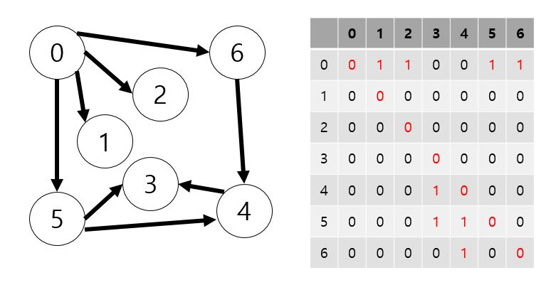
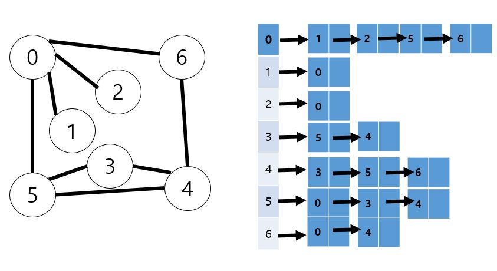
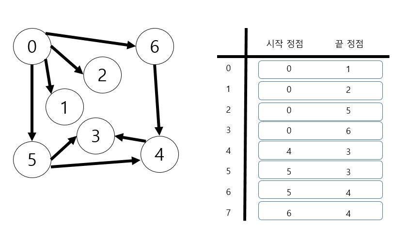

# 그래프

- 그래프는 아이템들과 이들 사이의 연결 관계를 표현
    - 정점(Vertex) : 그래프의 구성요소로 하나의 연결점
    - 간선(Edge) : 두 정점을 연결하는 선
    - 차수(Degree) : 정점에 연결된 간선으 ㅣ수

- 그래프는 정점들의 집합과 이들을 연결하는 간선들의 집합으로 구성된 자료 구조 (N:M)
    - 완전 그래프 : 정점들에 대해 가능한 모든 간선들을 가진 그래프
    - 부분 그래프 : 원래 그래프에서 일부의 정점이나 간선을 제외한 그래프
    
## 인접 행렬(Adjacent matrix)
    - V x V 크기의 2차원 배열을 이용해서 간선 정보를 저장
    - 행 번호와 열 번호는 그래프의 정점에 대응 인접되어있으면 1, 그렇지 않으면 0 또는 가중치
    - 정점보다 간선이 적은 경우 비효율적

## 인접 리스트(Adjacent List)
    - 각 정점마다 다른 정점으로 나가는 간선의 정보를 저장
    - 각 정점에 대한 인접 정점들을 순차적으로 표현
    - 하나의 정점에 대한 인접 정점들을 각각 노드로 하는 연결 리스트로 저장

## 간선 리스트(Edge List)
    - 간선의 정보를 객체로 표현하여 리스트에 저장
    - 두 정점에 대한 간선 그 자체를 객체로 표현하여 리스트로 저장
    - 간선을 표현하는 두 정점의 정보를 나타냄(시작 정점, 끝 정점)

