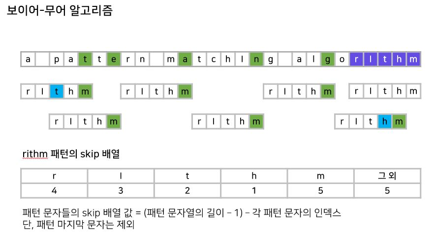

# Boyer-Moore(보이어 무어)

- 오른쪽에서 왼쪽 비교

- 시간 복잡도는 최악의 경우 O(MN)이지만 최선의 경우 O(N/M)이며 평균적으로 가장 빠른 알고리즘

- skip[ch] 배열을 만들어 관리하며 패턴의 길이가 skip 배열의 값이 됨

- skip 배열 값 = (패턴 문자열의 길이 -1) - 각 패턴 문자의 인덱스

- 패턴의 마지막을 문자열과 비교하여
    - 같으면 패턴을 비교하교 
    - 다르면 패턴만큼 건너뛰며 
    - 다르지만 패턴에 문자가 있는경우 패턴의 문자와 맞춰서 이동하여 비교

    
