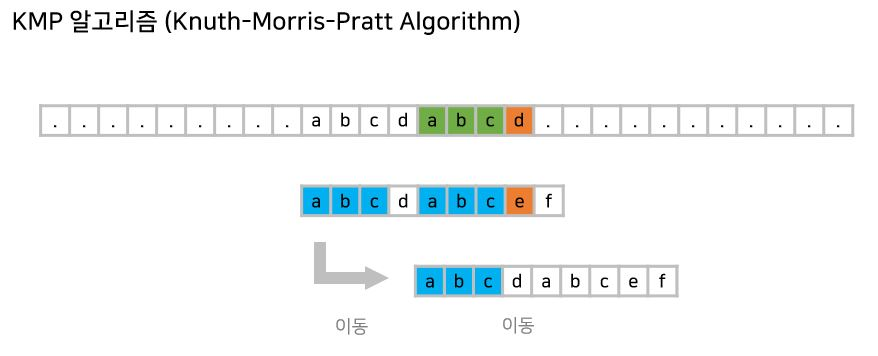

# Knuth-Morris-Pratt(KMP)

- 오른쪽에서 왼쪽 비교

- 불일치가 발생한 텍스트 문자열의 앞 부분에 어떤 문자가 있는지를 미리 알고 있으므로, 해당 부분에 대해 다시 비교하지 않고 매칭 수행

- 패턴을 전처리하여 부분일치 테이블 배열 pi[k]을 구해서 잘못된 시작을 최소화
    -pi[k] 배열 : 처음부터 k 인덱스까지를 끝으로 하는 부분 문자열에서 일치하는 접두사와 접미사가 일치하는 최대 길이를 저장하는 배열

- 시간 복잡도는 O(N+M)

    
