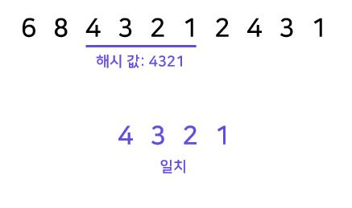

# Rabin-Karp(라빈-카프)

- 문자열 검색을 위해 해시 함수 사용
- 패턴 내 문자들을 일일이 비교하는 대신 패턴으 해시 값과 본문 안에 있는 하위 문자열의 해시 값만을 비교
- 최악의 경우 시간 복잡도는 브루트 포스와 동일하게 O(MN)이지만, 평균적으로는 선형에 가까운 속도를 가짐

    - 패턴의 해시 값을 계산
    - 찾고자 하는 문자열에서 패턴의 자리씩 해시 값 계산
    
